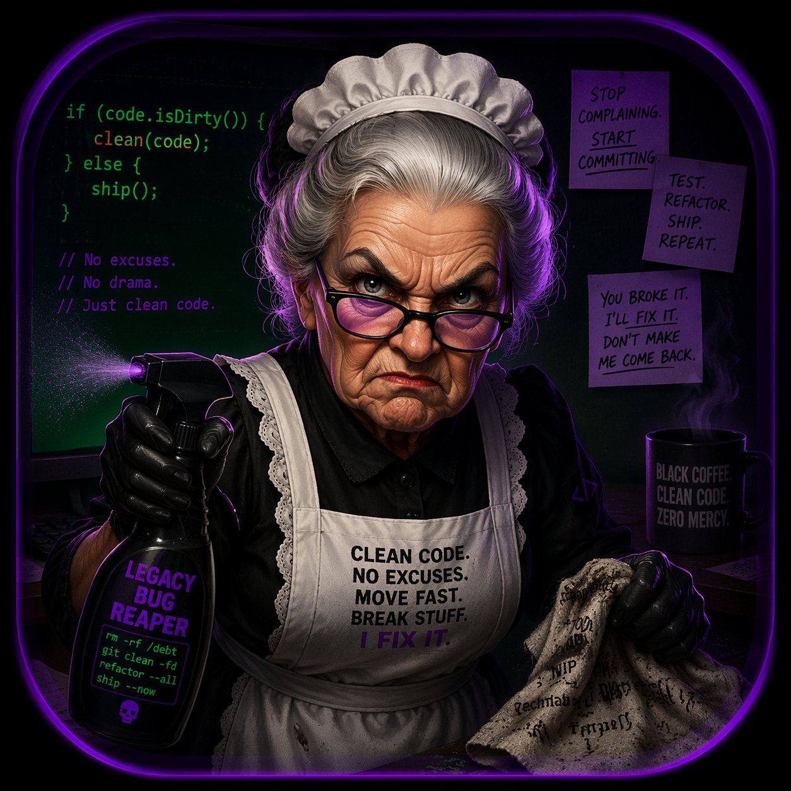

# CODEMAID — Core Architecture

<p align="center">
  
</p>

**Version:** 4.2.0
**Stack:** Python 3.10+, Rich, Requests, Ollama / OpenAI / Anthropic

---

## What Is CodeMAID?

A **local-first terminal AI coding assistant** with a full agentic tool-use loop. No telemetry, no cloud dependency — works fully offline with Ollama. Interact via a Rich TUI; the agent reads/writes files, runs sandboxed shell commands, searches the web, uses git, and remembers facts across sessions.

**Run:** `codemaid` or `python -m codemaid`

---

## Architecture Overview

```
┌──────────────────────────────────────────────┐
│  CLI / TUI  (codemaid/cli/)                  │
│  - Raw keypress input loop                    │
│  - Rich terminal rendering                    │
│  - Slash command dispatch                     │
│  - Streaming token display                    │
└──────────────────────┬───────────────────────┘
                       │
                       ▼
┌──────────────────────────────────────────────┐
│  Agent  (codemaid/agent.py)                  │
│  - Tool-use loop (up to 20 iterations)        │
│  - Parallel tool execution (ThreadPoolExec)  │
│  - Context window management + auto-compact  │
│  - Checkpoint / rewind support               │
│  - Auto-commit on file edits (optional)      │
└──────────────────────┬───────────────────────┘
                       │
          ┌────────────┴────────────┐
          ▼                         ▼
┌─────────────────┐     ┌──────────────────────┐
│  Providers       │     │  Tools               │
│  provider.py     │     │  tools/__init__.py   │
│  - Ollama        │     │  - file_tools        │
│  - OpenAI        │     │  - search_tools      │
│  - Anthropic     │     │  - web_tools         │
└─────────────────┘     │  - git_tools         │
                        │  - system_tools      │
                        │  - memory_tools      │
                        └──────────────────────┘
                                   │
                                   ▼
                        ┌──────────────────────┐
                        │  Vault               │
                        │  vault.py            │
                        │  - Denylist mode     │
                        │  - Allowlist mode    │
                        │  - Firejail wrapper  │
                        └──────────────────────┘
```

---

## Module Reference

### `codemaid/agent.py`
The brain. Runs the tool-use loop:
1. Sends messages + tools to the provider
2. Executes tool calls (parallel via `ThreadPoolExecutor`)
3. Feeds results back to the LLM
4. Loops until plain text response or 20 iterations
5. Detects stuck loops, empty responses, handles gracefully

Key features: `checkpoint()`, `restore_checkpoint()`, `rewind()`, `auto_commit`, `plan_mode`, `vault_on`

---

### `codemaid/cli/`
The interface layer. See `codemaid/cli/MOP.md` for full detail.

| File | Role |
|------|------|
| `main.py` | Entry point, raw keypress loop, TUI rendering, streaming |
| `commands.py` | Slash command handler |
| `config.py` | Theme, console, config file loading |

Special input modes: `!cmd` shell passthrough · `@file` inject file · `/slash` commands

---

### `codemaid/provider.py`
Unified LLM interface.

| Provider | Notes |
|----------|-------|
| Ollama | Local, default. Handles streaming. Normalizes dict-format tool args |
| OpenAI | OpenAI-compatible APIs |
| Anthropic | Converts OpenAI-format messages to Anthropic content blocks |

Factory: `get_provider(name, model, **kwargs)`

---

### `codemaid/tools/`
23 tools across 6 modules. See `codemaid/tools/MOP.md` for the full list.

---

### `codemaid/vault.py`
Three-layer command safety:
1. **Denylist** (default): blocks dangerous patterns (`rm -rf /`, `curl | sh`, `eval`, reverse shells)
2. **Allowlist** mode: only permits explicitly known-safe commands
3. **Firejail** wrapper: optional container isolation if `firejail` is installed

Toggle: `/vault` · `/allowlist` · Ctrl+S for one-off sudo bypass

---

### `codemaid/skills_loader.py`
Builds the system prompt from layered sources:

| Layer | Source |
|-------|--------|
| Instructions | `~/.agents/instructions.md` — who you are, how you work |
| MOP Persona | `codemaid/profiles/<name>.md` — agent behavior and tone |
| Rules | `~/.agents/rules/*.md` — hard constraints |
| Backbone | Hardcoded operating logic |
| Skills | `~/.agents/skills/` — capability definitions |

Switch persona: `/persona <name>`

---

### `codemaid/memory.py`
Persistent JSON memory. Stores facts in `.agents/codemaid_memory.json` in the working directory. Injects recent facts into the system prompt on session start.

---

### `codemaid/onboarder.py`
Interactive setup wizard for first-time configuration: provider, API keys, model, personas, vault settings.

---

### `codemaid/sessions/`
Session logging and HTML export. SQLite-backed storage at `~/.agents/sessions/codemaid.db`.

---

### `codemaid/cat.py`
Random cat jokes for `/cat`. Essential.

---

## MOP — Manager of Personas

MOP is CodeMAID's identity layer. Persona files in `codemaid/profiles/` define agent tone, style, and system knowledge. Switch with `/persona <name>`.

Built-in personas: `default` · `owner` · `claude` · `gemini-code` · `qwen-14b` · `qwen-27b`

Custom: drop a `.md` file in `codemaid/profiles/` — see `sample-custom.md` for the template.

---

## Security Model

| Layer | Mechanism |
|-------|---------|
| Command filtering | Vault denylist / allowlist |
| Path confinement | `_check_confinement()` in `tools/common.py` |
| Container isolation | Optional Firejail wrapping |
| SSRF protection | Metadata IP block in `web_tools.py` |

---

## Sub-level Docs

- `codemaid/tools/MOP.md` — all 23 tools
- `codemaid/cli/MOP.md` — CLI/TUI layer detail
