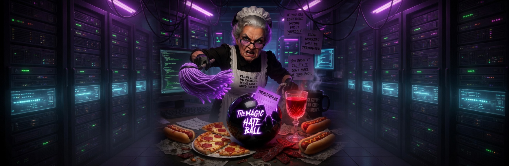

# CodeCrew Ecosystem 

<p align="center">
  
</p>

## The Local-First AI Infrastructure
CodeCrew is a comprehensive, local-first AI stack designed for persistent memory, cascading project context, and autonomous persona management. No subscriptions, no cloud, no Docker—just pure Python and Ollama.

### 🔱 The Three Pillars

- **[CodeCREW](./CodeCREW)** — **Mission Control (TUI)**
  - Real-time terminal interface built with `blessed`.
  - The "cockpit" where you interact with your agents.
  
- **[CodeMAID](./CodeMAID)** — **The Director (Dashboard)**
  - Web-based management UI and API Bridge.
  - Houses the **Vault** security mechanism and the **Onboarding Wizard**.

- **[CodeMOP](./CodeMOP)** — **The Engine (Manager Of Personas)**
  - Core logic for cascading context (`rtfm.md`).
  - **Dual-Memory System**: Short-term reasoning buffers (KV-style) and Long-term verified decisions.

---

## 🧠 Memory Architecture

This system implements a sophisticated dual-tier memory model:

1. **Short-Term (Reasoning Buffer)**: An in-memory cache of active session intent, automatically pruned via **Reasoning Retention Cleanup**.
2. **Long-Term (Verified Decisions)**: A persistent SQLite-backed library of verified facts and architectural decisions injected into the system prompt.

---

## 🚀 Quick Start

1. **Prerequisites**: 
   - [Ollama](https://ollama.com) installed and running.
   - Python 3.11+.

2. **Setup**:
   ```bash
   cd CodeMAID
   pip install -e .
   codemop-setup
   ```

3. **Launch**:
   - **TUI**: `python CodeCREW/codecrew.py`
   - **Dashboard**: `python CodeMAID/codemaid.py`

---

## 🎨 Project Artwork
Built for an "alive" aesthetic, matching the Netdata/Dark-Mode style. 
See the [Manual](./CodeMAID/manual.html) for full documentation.

<p align="center">
  
</p>

---

## 📜 License
MIT — Michael Robinson (RuMoR / CuckaOccurs)
